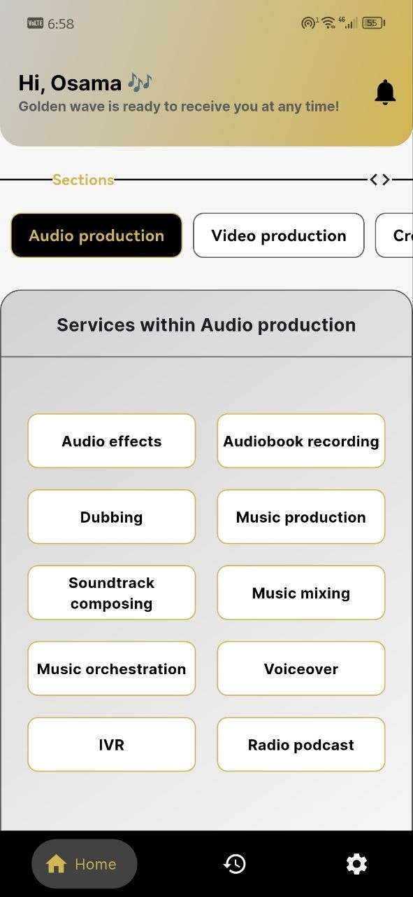
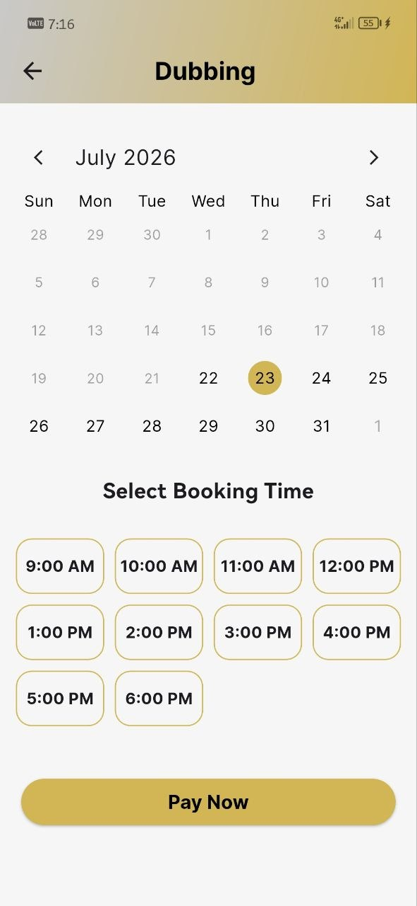
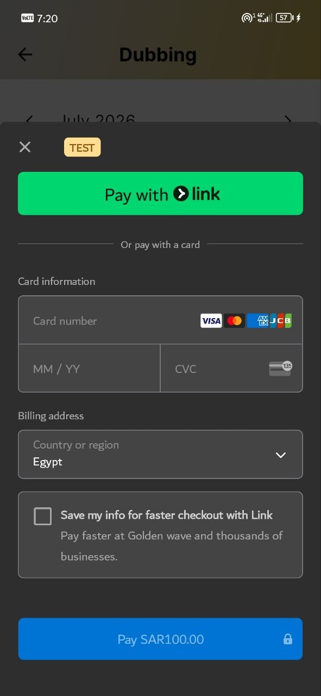
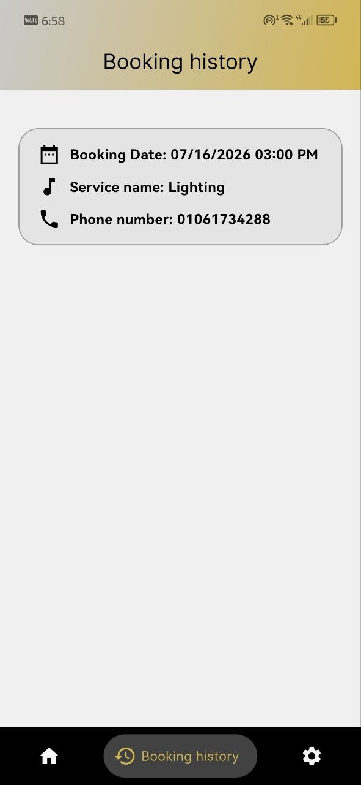
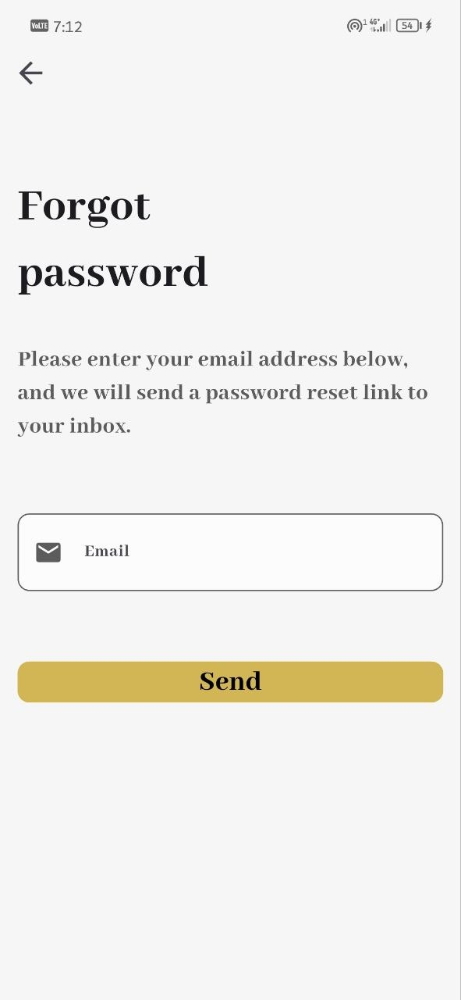
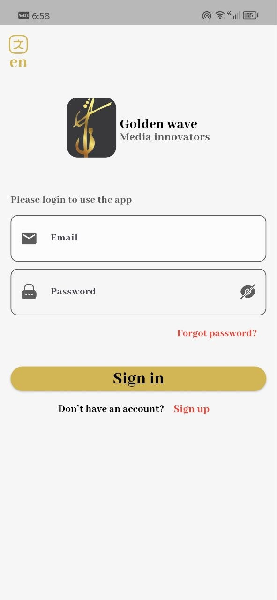
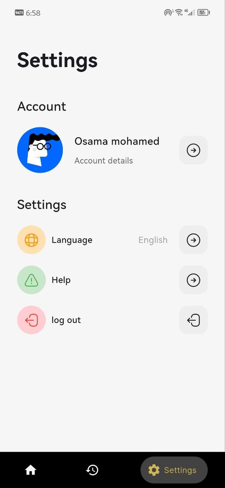
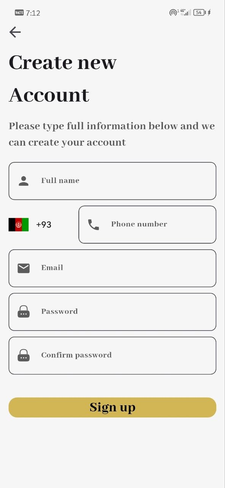

# 🎬 Golden Wave

A sleek Flutter app for booking sessions at a music recording & video production studio — browse services, pick a date and time slot, pay securely, and manage your bookings all in one place.

<!-- 
📸 ضيف هنا صورة أو GIF رئيسية للتطبيق (اللي هتظهر فوق كل حاجة)
مثال:

-->

## ✨ Features
- 🎙️ Browse studio services & book a session (date + time slot)
- 💳 Secure online payments via Stripe
- 🔒 User authentication (Firebase Auth) with onboarding flow
- 👤 Account details & profile management
- 🧾 Booking history for each user
- 🔔 Notifications
- 🌐 Multi-language support (Arabic & English) via `intl`
- ⚙️ Settings & help screens
- 🎨 Clean, modern UI

## 📱 Screenshots
<!-- 
ضيف صور الشاشات هنا، صورتين أو تلاتة جنب بعض بيبقوا شكلهم كويس في جدول
-->
| Home Screen | Booking Screen | Payment | History | forgot password | login |logo |settings |sign up |
|:---:|:---:|:---:|
|  |  |  | | | | | | |

## 🎥 Demo
<!-- 
GitHub مش بيشغل فيديوهات .mp4 مباشرة جوه الـ README، بس بيقبل GIF عادي.
لو عندك فيديو demo، حوّله لـ GIF (هنقولك ازاي تحت)، أو ارفعه واحط لينك ليه.
-->


## 🛠️ Tech Stack
- **Flutter** & **Dart**
- **Firebase** — Firestore, Authentication
- **Stripe** — payment processing
- **Provider** — state management
- **intl** — localization (Arabic & English)
- **shared_preferences** — local storage

## 🏗️ Architecture
The project follows a layered architecture with localization support:
```
lib/
├── constants/              # App-wide constants (colors, etc.)
├── generated/              # Auto-generated localization files (l10n.dart)
├── l10n/                   # Localization source files
│   ├── intl_ar.arb         # Arabic translations
│   └── intl_en.arb         # English translations
├── presentation/
│   ├── AuthManagement/     # Auth-related logic/widgets
│   ├── screens/
│   │   ├── onBording/      # Onboarding flow
│   │   ├── account_details.dart
│   │   ├── booking_screen.dart
│   │   ├── help.dart
│   │   ├── history.dart
│   │   ├── home.dart
│   │   ├── notifications.dart
│   │   └── settings.dart
│   └── widgets/            # Reusable UI components
├── provider/               # State management (ChangeNotifier providers)
│   ├── auth_provider.dart
│   ├── booking_provider.dart
│   ├── fetch_data_provider.dart
│   └── history_provider.dart
└── main.dart
```

## 🚀 Getting Started

### Prerequisites
- [Flutter SDK](https://docs.flutter.dev/get-started/install)
- A Firebase project (Firestore + Authentication enabled)
- A [Stripe](https://stripe.com) account (test mode is fine for development)

### Setup
1. Clone the repo
   ```bash
   git clone https://github.com/Osama-mohamed77/golden-wave.git
   cd golden-wave
   ```
2. Install dependencies
   ```bash
   flutter pub get
   ```
3. Add your Firebase config
   - Place your `google-services.json` in `android/app/`
   - Generate `firebase_options.dart` using the [FlutterFire CLI](https://firebase.google.com/docs/flutter/setup)
4. Add your Stripe keys in `lib/data/service/payment_service.dart`
   ```dart
   static const String _publishableKey = 'YOUR_STRIPE_PUBLISHABLE_KEY';
   static const String _secretKey = 'YOUR_STRIPE_SECRET_KEY'; // keep this on a backend, not in the app
   ```
5. Run the app
   ```bash
   flutter run
   ```

## 📄 License
This project is for learning purposes.
